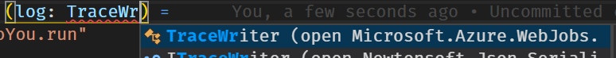
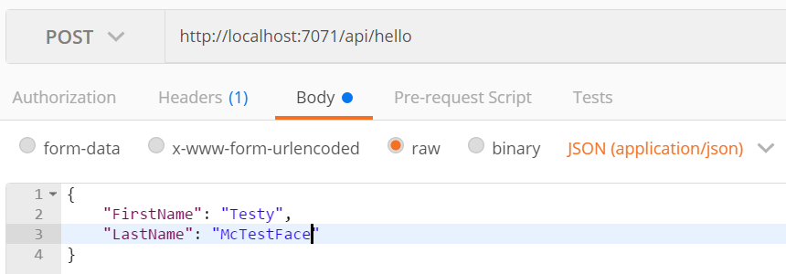

+++
title = "Building Azure Functions With Precompiled F#"
abstract = "Create a simple Azure Function using Precompiled F#, VS Code, and v2 of the Azure Functions Core Tools."
date = 2018-04-29
tags = ['Azure', 'FSharp', 'Azure Functions', 'Visual Studio Code']
draft = false
github = "https://github.com/mikesigs/building-azure-functions-with-precompiled-fsharp"

[header]
image = "headers/blue-and-pink-css-code.jpg"
preview = true
+++

Previously we looked at [Building Azure Functions with F# Script](../building-azure-functions-with-fsharp-and-vscode), which is still the only _supported_ way of creating an Azure Function with F#, and a decent option for simple functions. So, if you need to play it safe (and stable) then that's your best bet. However, in this post we are going to take a trip to the edge. We'll be using .NET Core, Azure Functions Core Tools v2, and F#. However, instead of F# _Script_ we'll be creating a _precompiled_ app!

Being on the bleeding edge has its drawbacks however. Chances are we're going to see some bugs. The Core Tools are in beta after all, so that should be expected. I will explain how I work around the current issues, but chances are things will change between now and the time you read this. So if you _don't_ encounter an issue we're solving here, that's fantastic. It means Azure Functions with F# is moving in the right direction!

So without further ado, let's get started.

## Setup Your Environment

If you're not already setup for F# Azure Functions development, you can follow the same instructions [from my previous post](../building-azure-functions-with-fsharp-and-vscode/1-setup/), _with one exception_. You will need to install v2 instead of v1 of the Azure Functions Core Tools. I would recommend you install it with npm instead of Chocolatey. I had some issues using the Chocolatey version and never got to the bottom of it.

To install v2 of the Core Tools use this command:

```shell
npm i -g azure-functions-core-tools@core --unsafe-perm true
```

Also, did I say "one exception"? I meant two. You'll also need to [install the .NET Core SDK](https://www.microsoft.com/net/learn/get-started/windows#install).

Okay... _three_. Sheesh. I'm also going to use the [NuGet Package Manager](https://github.com/jmrog/vscode-nuget-package-manager) extension in Visual Studio Code, so you might as well install that now as well.


  You could use Paket to manage the dependencies instead of NuGet. It's far more popular within the F# community. But I want to limit the number of new technologies for newcomers to F# in these posts. I'll get to Paket one day.


## Create The Function App

Now that you have what you need, let's create our app. There is no F# template available yet, so we're going to cheat a little and use the C# template and just change a few things. Here we go...

- Create a new directory (call it what you want)
- Open VS Code
- Invoke `Azure Functions: Create New Project` in the Command Pallette
- Follow the prompts:
  - **Select the folder that will contain your function app:** Press [Enter] to pick the current folder
  - **Select a language for your function project:** Pick C#

You now have an empty Function App, initialized as a git repository. There's a `.gitignore` file tailor-made for Azure Functions development.

The first thing we should do is rename the `.csproj` to `.fsproj`. While you're in there, notice that we're using the new project file format, as well as `netstandard2.0`.

Besides the Git repo and project file, there are actually quite a few goodies nestled in the `.vscode` folder.

### VS Code Goodies

The C# template is configured for making Azure Functions development in VS Code an awesome experience. However, not all of it is going to help us with F#. So let's crack open each of these configuration files and see what we need to change. Expand the `.vscode` folder in VS Code, and let's dig in.

#### extensions.json

This file tells VS Code what extensions to recommend for the project. Obviously, we won't be needing the **ms-vscode.csharp** extension, so you can remove it.

#### launch.json

Here we find a configuration that allows us to attach a debugger to our function. How awesome is that! Also, you should rename **C#** to **F#** in the `name` field. Sure it's a minor detail, but those who know me know I can't live with these kind of inconsistencies! I feel better now. Do you?

#### settings.json

This is where you customize VS Code's workspace settings. In this case, there's some configuration for the Azure Functions extension. We _should_ change `azureFunctions.projectLanguage` to `F#`. However, it might be useful to leave this alone so we can generate new Functions based on their C# templates and simply port them to F#. I'll leave this decision up to you.

#### tasks.json

Last, _but certainly not least,_ are the three tasks that allow you to **clean**, **build**, and **run** your Function App from the VS Code Command Palette. Or, if you prefer, using the following keyboard shortcuts:

- **build:** `Ctrl+Shift+B`.
- **Run Functions Host:** `Ctrl+Shift+R` (with a [custom keybinding](/post/building-azure-functions-with-fsharp-and-vscode/3-running-locally/#create-a-custom-keybinding))

## If You Build It, They Will... Oh

If you attempt to build the app now, you might see the following warning in the terminal. If not, feel free to skip this section.

> warning NU1701: Package 'Microsoft.AspNet.WebApi.Client 5.2.2' was restored using '.NETFramework,Version=v4.6.1' instead of the project target framework '.NETStandard,Version=v2.0'. This package may not be fully compatible with your project.

To fix this, we'll need to update our version of **Microsoft.NET.Sdk.Functions**. Open the Command Palette and invoke `NuGet Package Manager: Add Package` and search for **Microsoft.NET.Sdk.Functions**. Select the latest version and continue. When I wrote this, the latest version was **1.0.13**.

Once that completes you should be able to build without warnings.

## Create a Function

As mentioned above, there are no F# templates yet. So the Azure Functions extension can't help us to create a new F# function. If you chose not to change `azureFunctions.projectLanguage` to `F#` in the `settings.json`, then you _could_ generate one in C# and convert it. But that's not what we're going to do. We'll learn more by creating one from scratch.

We will use the new **Attributed Model** to define our function. This means we don't have to manage the `function.json` file anymore. It's generated at compile time based on the attributes! Full disclosure, the attributes are kinda ugly, but we'll explore [a strategy to deal with that](./#let-s-deal-with-those-attributes) later.

Like [last time](../building-azure-functions-with-fsharp-and-vscode/2-create-function-app/), we're going to create an **HttpTrigger** function called **HelloYou**. Start by create a new file at the root of your project called `HelloYou.fs`. You'll have to add a reference to the new file in your `.fsproj`. The Ionide plugin provides a quick way to do this via the `F#: Add Current File To Project` command. However, when I wrote this it wasn't working. So make sure to check the project file has this added to it:

```xml
  <ItemGroup>
    <Compile Include="HelloYou.fs" />
  </ItemGroup>
```

Add the following code to `HelloYou.fs`. We're going to keep things simple for now and just echo back "Hello". It's a start.

```fsharp
namespace MyFunctions

open Microsoft.Azure.WebJobs
open Microsoft.AspNetCore.Http
open Microsoft.AspNetCore.Mvc

module HelloYou =
    [<FunctionName("HelloYou")>]
    let run
        ([<HttpTrigger(Extensions.Http.AuthorizationLevel.Anonymous, "get", Route = "hello")>]
        req: HttpRequest) =
            ContentResult(Content = "Hello", ContentType = "text/html")
```

### Check out those ugly attributes

Personally, I think the attributes are kinda ugly. But their inner beauty is not have to maintain a `function.json`. Let's take a quick peek at the two we're using here.

#### FunctionName

The `FunctionName` attribute marks this as a function entry point. This name must be unique within your Function App. It also let's you name the function in code whatever you want, e.g. `run`.

#### HttpTrigger

All functions need to be triggered somehow. In our case, we're using the `HttpTrigger` attribute to indicate this function is triggered by an HTTP call. It takes several parameters:

- **authLevel:** Sets the [authorization level](https://docs.microsoft.com/en-us/azure/azure-functions/functions-bindings-http-webhook#authorization-keys) for the function, i.e. what keys need to be provided to invoke the function.
- **methods:** Indicates which HTTP verbs the function is triggered by. In our case we're just using GET
- **route:** The route to our function

## If You Run It, They Will... Oh

I liked that heading so much I thought I'd reuse it for our second gotcha!

If you run function, you _might_ see the following error:

> System.Private.CoreLib: Could not load file or assembly 'FSharp.Core, Version=4.4.3.0, Culture=neutral, PublicKeyToken=b03f5f7f11d50a3a'. Could not find or load a specific file.

If you don't see this, fantastic! Move on to the next section. But if you do...
This is caused by an assembly version mismatch in the Azure Functions Core Tools runtime. In this case, it's the **FSharp.Core** assembly. Like you, I am using the latest F# version on my machine, so our app is attempting to load `FSharp.Core, Version=4.4.3.0`. But the Azure Functions runtime has only loaded **v4.2.3**. To fix this, we will install the **FSharp.Core** NuGet package for the version used by the Azure Functions runtime.

Stop the Function Host if it's still running (press `Ctrl+C` in the terminal). Then invoke the `NuGet Package Manager: Add Package` command and find `FSharp.Core`. Install version **4.2.3**. Once complete you should see a new `PackageReference` in the `.fsproj` for **FSharp.Core**.

## If You Run It, It Will... Run!

Okay, _NOW_ you can start the function host and everything should be just hunky dory. If you `Ctrl+Click` the HelloYou link <http://localhost:7071/api/hello> in the terminal window your browser should open up a page that says "Hello".

Amazing! Look at us fancy programmers with our "Hello" string. But we can do better...

## Let's Deal With Those Attributes

I think I read somewhere that it's a good practice to keep the attributed function declarations separate from your actual code. But in case I'm imagining that, then you can say you read it here first.

Let's create a `Functions.fs` file at the root of our project and put our attributed function there. Don't forget to update the `.fsproj`.

### Functions.fs

```fsharp
namespace MyFunctions

open Microsoft.Azure.WebJobs
open Microsoft.AspNetCore.Http

module Functions =

    [<FunctionName("HelloYou")>]
    let helloYou
        ([<HttpTrigger(Extensions.Http.AuthorizationLevel.Anonymous, "get", Route = "hello")>]
        req: HttpRequest) =
            HelloYou.run req
```

### fsproj

The ordering here is important!

```xml
  <ItemGroup>
    <Compile Include="HelloYou.fs"/>
    <Compile Include="Functions.fs"/>
  </ItemGroup>
```

### HelloYou.fs

```fsharp
namespace MyFunctions

open Microsoft.AspNetCore.Http
open Microsoft.AspNetCore.Mvc

module HelloYou =
    let run (req: HttpRequest) =
        ContentResult(Content = "Hello", ContentType = "text/html")
```

Now that the Azure Functions stuff is separated, we are free to write more canonical F# in our `HelloYou.fs`.
Make sure you run the function again to make sure it still works.

## This Isn't Even My Final Form

Now that we've got things running, and we've shunted our attributes to a separate file, let's fill out the rest of our function!


  Instead of copy/pasting the code below, try writing it yourself. Use the auto-open feature of Ionide to automatically add the necessary `open` statements for your code. Simply write part of the identifier, e.g. `TraceWr` and when the intellisense suggests:  hit **[Enter]** to complete the statement and add the `open` statement at the top of the file.


### Changes to Functions.fs

We're going to add some logging to our function. So we'll need to add a `log: TraceWriter` parameter to our function declaration. We're also going to use HTTP POST instead of GET, so we'll need to update the list of supported `methods`.

Our `Functions.fs` now looks like this:

```fsharp
namespace MyFunctions

open Microsoft.Azure.WebJobs
open Microsoft.AspNetCore.Http
open Microsoft.Azure.WebJobs.Host

module Functions =

    [<FunctionName("HelloYou")>]
    let helloYou
        ([<HttpTrigger(Extensions.Http.AuthorizationLevel.Anonymous, "post", Route = "hello")>]
        req: HttpRequest,
        log: TraceWriter) =
            HelloYou.run req log
```

### Changes to HelloYou.fs

The `HelloYou.run` function itself is going to have a number of changes.

- We're adding the ability to take some input JSON, which needs to be deserialized. For that, we define a new record type called `InputModel`
- We'll then read the `req.Body` using a `StreamReader`
- Deserialize the input with `JsonConvert.DeserializeObject`
- Do some quick validation of the input to ensure both **FirstName** and **LastName** are provided
- If our validation fails we return a `BadRequestObjectResult`
- Otherwise we return an `OkObjectResult` with our response
- We've also added some logging, and wrapped the whole thing in an async workflow


  Notice that we have to cast these responses to the same result type using `:> IActionResult` in order to appease the F# compiler.


Our `HelloYou.fs` now looks like this:

```fsharp
namespace MyFunctions

open Microsoft.AspNetCore.Http
open Microsoft.AspNetCore.Mvc
open Microsoft.Azure.WebJobs.Host
open System.IO
open Newtonsoft.Json
open System

module HelloYou =
    type InputModel = {
        FirstName: string
        LastName: string
    }

    exception InvalidInputException of string

    let run (req: HttpRequest) (log: TraceWriter) =
        log.Info "[Enter] HelloYou.run"
        async {
            use stream = new StreamReader(req.Body)
            let! body = stream.ReadToEndAsync() |> Async.AwaitTask
            let input = JsonConvert.DeserializeObject<InputModel>(body)
            if (String.IsNullOrWhiteSpace input.FirstName) || (String.IsNullOrWhiteSpace input.LastName) then
                log.Info "Received by input"
                return BadRequestObjectResult "Please pass a JSON object with a FirstName and a LastName." :> IActionResult
            else
                log.Info "Received good input"
                return OkObjectResult (sprintf "Hello, %s %s" input.FirstName input.LastName) :> IActionResult
        }
        |> Async.RunSynchronously
```

You should be able to run this locally now and test it with Postman. Here's what a good request looks like:



Notice, there is no error handling. So if you pass some invalid input you'll get a **500 Internal Server Error** back.

## A Final Note About the `function.json`

Without the function attributes we would've needed to create and maintain a `function.json` file. Fortunately, this gets generated for us at compile time and can be found in `bin\Debug\netstandard2.0\HelloYou\function.json`. It looks like this:

```json
{
  "generatedBy": "Microsoft.NET.Sdk.Functions-1.0.13",
  "configurationSource": "attributes",
  "bindings": [
    {
      "type": "httpTrigger",
      "route": "hello",
      "methods": [
        "post"
      ],
      "authLevel": "anonymous",
      "name": "req"
    }
  ],
  "disabled": false,
  "scriptFile": "../bin/building-azure-functions-with-precompiled-fsharp.dll",
  "entryPoint": "MyFunctions.Functions.helloYou"
}
```

Notice that it calls out the fact it's a generated file with the `generatedBy` property. And check out those bindings. You can see in the `req` binding it lists the only method supported is **post**, and the `authLevel` we specified is set to **anonymous**. It's got our `route` specified there as well.

Two other properties, essential to a precompiled app, are listed at the end:

- `scriptFile`: Point to the compiled assembly
- `entryPoint`: Indicates the **[namespace].[module].[function]** of the function, in this case `MyFunctions.Functions.helloYou`

## What's Next

We covered a ton of ground on this one! Working with Pre-Compiled apps gives us a ton of flexibility. Also, we didn't need that weird [Editor Prelude](../building-azure-functions-with-fsharp-and-vscode/2-create-function-app/#holy-squigglies) thing. But we did lose the slickness of auto-reloading on changes that is supported by F# (and C#) Script. The good news is, that's been implemented already and will likely be included in the next beta release of the core tools!

Why not try [deploying this to your Azure account](../building-azure-functions-with-fsharp-and-vscode/4-deploy-to-azure/). Once you do, notice that none of the code is editable in the Azure Portal. That's because it's a precompiled app. The only thing you'll see there is the generated `function.json`.

Oh, and try attaching the debugger to your function! Just run the function, set a breakpoint, and press `F5`. Super easy!

That's it for now. And thanks for reading!